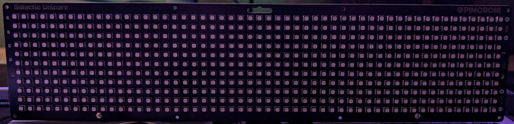
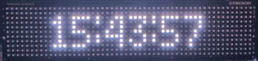
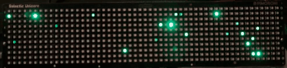
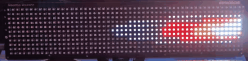
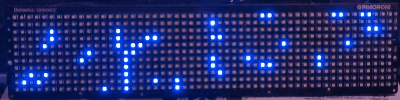
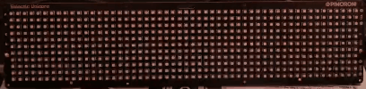

<div align="center">
  
  <h1 align="center">Unicorn-Pi Galactic</h1>
  <p align="center">
    Software for displaying the best effects and animations on the Pimoroni Galactic Unicorn.
  </p>
  <p align="center">
    The effects in this software are written in Python and designed to be easy to use, modify individually, and test. Suggestions for new effects or animations are always welcome. Thank you for checking out this project!
  </p>
</div>

## Index <a name="index"></a>

- [Build Status](#build-status)
- [Parts List](#parts-list)
- [Previews](#previews)
- [Software Guide](#software-guide)
- [Development](#development)
- [Licensing](#licensing)
- [Wrapping Up](#wrapping-up)

<!---------------------------------------------------------------------------->
<!---------------------------------------------------------------------------->
<!---------------------------------------------------------------------------->

## Build Status <a name="build-status"></a>

[](https://github.com/CodyTolene/Unicorn-Pi-Galactic/actions/workflows/lint.yml)

<p align="right">[ <a href="#index">Index</a> ]</p>

<!---------------------------------------------------------------------------->
<!---------------------------------------------------------------------------->
<!---------------------------------------------------------------------------->

## Parts List <a name="parts-list"></a>



| Part                                      | Price (USD) |
| :---------------------------------------- | :---------- |
| [Pimoroni Galactic Unicorn][url-galactic-unicorn] | $65.00      |

<p align="right">[ <a href="#index">Index</a> ]</p>

<!---------------------------------------------------------------------------->
<!---------------------------------------------------------------------------->
<!---------------------------------------------------------------------------->

## Previews <a name="previews"></a>

| Name                 | Preview                                                           |
| :------------------- | :---------------------------------------------------------------- |
| Digital Clock        |        |
| Digital Rain         |          |
| DVD Bouncer          |            |
| Emergency            |                |
| Fire                 |                          |
| Fireflies            |                |
| Fireplace            |                |
| Fireworks            |                |
| Flashlight Torch     |  |
| Lava Lamp            |                |
| Lightning (w/ sound) |                |
| Plasma               |                      |
| Rainbow (default)    |                    |
| Raindrops            |                |
| SOS (Morse Code)     |                            |
| Snowfall             |                  |
| Warp Speed           |              |
| Wave                 |                          |

More coming soon!

Have another idea? Share it [here][url-new-issue]. You can also fork this repo and submit a pull request with your own effect or animation! I'd love to see what you come up with.

<p align="right">[ <a href="#index">Index</a> ]</p>

<!---------------------------------------------------------------------------->
<!---------------------------------------------------------------------------->
<!---------------------------------------------------------------------------->

<!-- 
## Software Setup <a name="software-setup"></a>

TODO: Add software setup instructions.

<p align="right">[ <a href="#index">Index</a> ]</p>
-->

<!---------------------------------------------------------------------------->
<!---------------------------------------------------------------------------->
<!---------------------------------------------------------------------------->

## Software Guide <a name="software-guide"></a>

Button layout

```bash
|===========================================================|
| (A) oooooooooooooooooooooooooooooooooooooooooooooooo (V+) |
| (B) oooooooooooooooooooooooooooooooooooooooooooooooo (V-) |
| (C) oooooooooooooooooooooooooooooooooooooooooooooooo (Zz) |
| (D) oooooooooooooooooooooooooooooooooooooooooooooooo (L+) |
|     oooooooooooooooooooooooooooooooooooooooooooooooo (L-) |
|===========================================================|
```

| Button | Action                |
| :----- | :-------------------- |
| "A"    | Next view/scene.      |
| "B"    | Previous view/scene.  |
| "C"    | Varies by view/scene. |
| "D"    | Varies by view/scene. |
| "V+"   | Increase volume.      |
| "V-"   | Decrease volume.      |
| "Zz"   | Sleep or Awaken.      |
| "L+"   | Increase brightness.  |
| "L-"   | Lower brightness.     |

<p align="right">[ <a href="#index">Index</a> ]</p>

<!---------------------------------------------------------------------------->
<!---------------------------------------------------------------------------->
<!---------------------------------------------------------------------------->

## Development <a name="development"></a>

1. Make sure you have Python installed on your computer (3.8+). You can download Python from the [official website][url-python-downloads]. 

2. Run the following in a terminal at the root of this repository to install development dependencies:

```bash
# Install the required packages
python3 -m pip install -r requirements.txt
# Install the pre-commit hooks
pre-commit install
# Update the pre-commit hooks
pre-commit autoupdate
```

3. Make your code changes using Thonny, add new views, fix a bug, etc.

4. Test using Thonny by connecting your Raspberry Pi Pico to your computer. Run the `main.py` script or any view script individually by pressing the "Run" button with the file open.

5. When your changes are in you can optionally run the following commands to lint and format your code:

```bash
# Format
python3 -m black scripts/
# Lint
python3 -m flake8 --show-source --ignore E501 scripts/
```

> ![Info][img-info] These scripts will also run automatically when you commit changes (pre-commit hooks) to ensure code quality.

6. Submit a pull request with your changes.

<p align="right">[ <a href="#index">Index</a> ]</p>

<!---------------------------------------------------------------------------->
<!---------------------------------------------------------------------------->
<!---------------------------------------------------------------------------->

## Licensing <a name="licensing"></a>

This project is licensed under the Apache License, Version 2.0. See the [APACHE_2_LICENSE](LICENSE) file for the pertaining license text.

`SPDX-License-Identifier: Apache-2.0`

<p align="right">[ <a href="#index">Index</a> ]</p>

<!---------------------------------------------------------------------------->
<!---------------------------------------------------------------------------->
<!---------------------------------------------------------------------------->

## Wrapping Up <a name="wrapping-up"></a>

Thanks to all the people and projects that made this possible! I hope you enjoy this project as much as I enjoyed working on it. If you have any questions, please let me know by opening an issue [here][url-new-issue].

| Type                                                                      | Info                                                                      |
| :------------------------------------------------------------------------ | :------------------------------------------------------------------------ |
|                 | webmaster@codytolene.com                                                  |
|      | https://www.buymeacoffee.com/codytolene                                   |
|  | [bc1qfx3lvspkj0q077u3gnrnxqkqwyvcku2nml86wmudy7yf2u8edmqq0a5vnt][url-btc] |

Fin. Happy programming friend!

Cody Tolene

<!---------------------------------------------------------------------------->
<!---------------------------------------------------------------------------->
<!---------------------------------------------------------------------------->

<!-- IMAGE REFERENCES -->

[img-info]: .github/images/ng-icons/info.svg
[img-warning]: .github/images/ng-icons/warn.svg

<!-- LINK REFERENCES -->

[url-btc]: https://explorer.btc.com/btc/address/bc1qfx3lvspkj0q077u3gnrnxqkqwyvcku2nml86wmudy7yf2u8edmqq0a5vnt
[url-new-issue]: https://github.com/CodyTolene/Unicorn-Pi-Galactic/issues/new
[url-pi-pico]: https://www.raspberrypi.org/products/raspberry-pi-pico/
[url-pimoroni-pico-guide]: https://learn.pimoroni.com/tutorial/pico/getting-started-with-pico
[url-python-downloads]: https://www.python.org/downloads/
[url-thonny]: https://thonny.org/
[url-galactic-unicorn]: https://shop.pimoroni.com/products/space-unicorns?variant=40842033561683

<!---------------------------------------------------------------------------->
<!---------------------------------------------------------------------------->
<!---------------------------------------------------------------------------->
