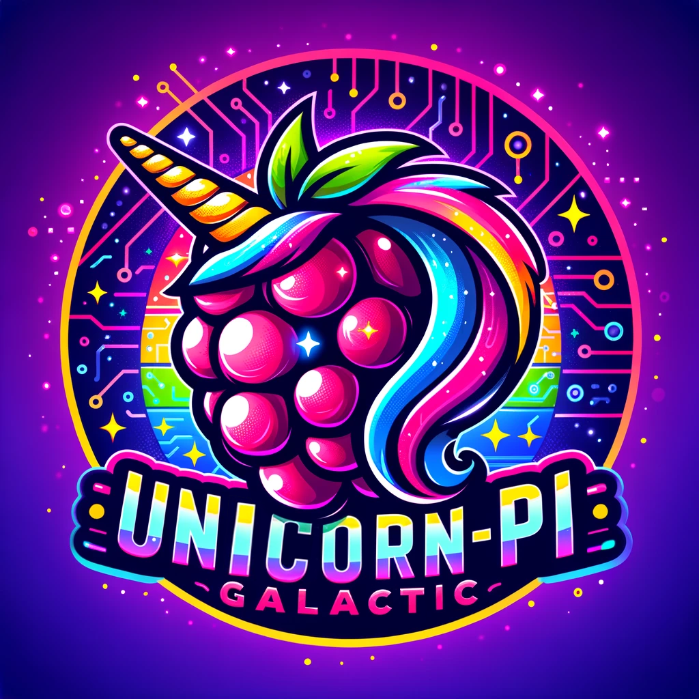

<div align="center">
  
  <h1 align="center">Unicorn-Pi Galactic</h1>
  <p align="center">
    Software for your Pimoroni Galactic Unicorn that brings the best effects and animations to life. Use the onboard buttons to switch views, customize text colors, adjust brightness, and much more. Many effects and animations also feature custom sounds for an immersive experience.
  </p>
  <p align="center">
    The effects in this software are written in Python and designed to be easy to use, modify individually, and test. Suggestions for new effects or animations are always welcome. Thank you for checking out this project!
  </p>
</div>

## Index <a name="index"></a>

- [Build Status](#build-status)
- [Parts List](#parts-list)
- [Previews](#previews)
- [Software Guide](#software-guide)
- [Wi-Fi Setup](#wi-fi-setup)
- [User Options](#user-options)
- [Software Setup](#software-setup)
- [Development](#development)
- [Licensing](#licensing)
- [Wrapping Up](#wrapping-up)

<!---------------------------------------------------------------------------->
<!---------------------------------------------------------------------------->
<!---------------------------------------------------------------------------->

## Build Status <a name="build-status"></a>

[](https://github.com/CodyTolene/Unicorn-Pi-Galactic/actions/workflows/lint.yml)

<p align="right">[ <a href="#index">Index</a> ]</p>

<!---------------------------------------------------------------------------->
<!---------------------------------------------------------------------------->
<!---------------------------------------------------------------------------->

## Parts List <a name="parts-list"></a>

![Pimoroni Galactic Unicorn][img-galactic-unicorn]

| Part                                      | Price (USD) |
| :---------------------------------------- | :---------- |
| [Pimoroni Galactic Unicorn][url-galactic-unicorn] | $65.00      |

<p align="right">[ <a href="#index">Index</a> ]</p>

<!---------------------------------------------------------------------------->
<!---------------------------------------------------------------------------->
<!---------------------------------------------------------------------------->

## Previews <a name="previews"></a>

| Name                    | Sound(s)           | Wi-Fi | Preview                                   |
| :---------------------- | :----------------- | :---- | :---------------------------------------- |
| DVD Bouncer             | Bounce / Celebrate | False | ![DVD Bouncer][img-dvd-bouncer]           |
| Digital Clock (12 hour) | None               | True  | ![Digital Clock 12][img-digital-clock-12] |
| Digital Clock (24 hour) | None               | False | ![Digital Clock 24][img-digital-clock-24] |
| Digital Rain            | None               | False | ![Digital Rain][img-digital-rain]         |
| Emergency               | Siren Tones        | False | ![Emergency][img-emergency]               |
| Fire                    | None               | False | ![Fire][img-fire]                         |
| Fireflies               | Random Crickets    | False | ![Fireflies][img-fireflies]               |
| Fireplace               | Burning Noises     | False | ![Fireplace][img-fireplace]               |
| Fireworks               | Freedom Bursts     | False | ![Fireworks][img-fireworks]               |
| Flashlight Torch        | None               | False | ![Flashlight Torch][img-flashlight-torch] |
| Lava Lamp               | None               | False | ![Lava Lamp][img-lava-lamp]               |
| Lightning               | Thunder Claps      | False | ![Lightning][img-lightning]               |
| Nyan Cat                | Demo Music         | False | ![Nyan Cat][img-nyan-cat]                 |
| Plasma                  | None               | False | ![Plasma][img-plasma]                     |
| Rainbow (default)       | Relaxing Tones     | False | ![Rainbow][img-rainbow]                   |
| Raindrops               | Rain               | False | ![Raindrops][img-raindrops]               |
| SOS (Morse Code)        | None               | False | ![SOS][img-sos]                           |
| Snowfall                | None               | False | ![Snowfall][img-snowfall]                 |
| Stocks Display          | None               | True  | ![Stocks Display][img-stocks-display]     |
| Warp Speed              | None               | False | ![Warp Speed][img-warp-speed]             |
| Wave                    | None               | False | ![Wave][img-wave]                         |

> ![Warning][img-warning] This software may produce flashing lights, which can trigger seizures in individuals with photosensitive epilepsy. Please exercise caution if you or anyone who may be exposed to the lights has a history of epilepsy or seizures.

> ![Warning][img-warning] The use of emergency lights and/or siren sounds may be inappropriate or illegal in certain situations or locations. Users are responsible for ensuring compliance with local laws and regulations and must use this code responsibly. Use this software at your own risk. The author disclaims all responsibility for any misuse or adverse effects resulting from the use of this software.

> ![Info][img-info] Have another idea? Share it [here][url-new-issue]. You can also fork this repo and submit a pull request with your own effect or animation! I'd love to see what you come up with.

<p align="right">[ <a href="#index">Index</a> ]</p>

<!---------------------------------------------------------------------------->
<!---------------------------------------------------------------------------->
<!---------------------------------------------------------------------------->

## Software Setup <a name="software-setup"></a>

First make sure you have this repo cloned to your computer. If you don't have Git installed, you can download the repo as a ZIP file by clicking the green "Code" button at the top of this page. Follow the steps below to run the Python scripts in this repository on your Raspberry Pi Pico with the Pimoroni Unicorn Pack:

1. Similar to how you install the Pimoroni custom software to a Raspberry Pi Pico ([official guide][url-pimoroni-pico-guide]), you need to install the .uf2 file for the Pimoroni Galactic Unicorn. You can find the .uf2 file on the [Pimoroni GitHub Release Page][url-galactic-unicorn-release] where the file is generally named starting with "galactic_unicorn...". 

   > ![Info][img-info] This is a one-time setup.

2. Download and install the Thonny IDE from the [official website][url-thonny]. 

   > ![Info][img-info] This allows us to write and run Python code on the Galactic Unicorns Raspberry Pi Pico.

3. Open Thonny and connect your Galactic Unicorns Raspberry Pi Pico to your computer using a USB cable.

4. On the left hand side you should see the file explorer for your Galactic Unicorns Raspberry Pi Pico. Drag and drop all the files from the `scripts` folder in this repository to the root directory of your Galactic Unicorns Raspberry Pi Pico.

5. Unplug and replug your Galactic Unicorn to restart the device or press the "Reset" button on the back.

The file `main.py` will automatically run when the Galactic Unicorn is powered on.

<p align="right">[ <a href="#index">Index</a> ]</p>

<!---------------------------------------------------------------------------->
<!---------------------------------------------------------------------------->
<!---------------------------------------------------------------------------->

## Wi-Fi Setup <a name="wi-fi-setup"></a>

Some views may require you to have Wi-Fi connected to your Raspberry Pi Pico. Follow the steps below to connect your Raspberry Pi Pico to Wi-Fi:

1. After copying the options.json (see [User Options](#user-options) below for more information) file to the root directory of your Raspberry Pi Pico, open the file in Thonny or another IDE.

2. Add your Wi-Fi SSID and password to the `wifi_ssid` and `wifi_password` objects in the `options.json` file. Example:
  
    ```json
    {
      "wifi_ssid": "MY_WIFI_SSID", 
      "wifi_password": "MY_WIFI_PASSWORD",
    }
    ```

> ![Info][img-info] Connecting to Wi-Fi is optional and only required for views that need internet access.

<p align="right">[ <a href="#index">Index</a> ]</p>

<!---------------------------------------------------------------------------->
<!---------------------------------------------------------------------------->
<!---------------------------------------------------------------------------->

## User Options <a name="user-options"></a>

The `options.json` file contains user options that can be modified to customize the software or add additional functionality. The following options are available:

| Option                          | Default Value                      | Description                                          |
| :------------------------------ | :--------------------------------- | :--------------------------------------------------- |
| `wifi_ssid`                     | `""`                               | The SSID of your Wi-Fi network.                      |
| `wifi_password`                 | `""`                               | The password of your Wi-Fi network.                  |
| `stocks_finnhub_api_key`        | `""`                               | A FinnHub API Key for fetching current stock prices. |
| `stocks_symbols`                | `["NVDA", "AMD", "MSFT", "GOOGL"]` | A list of up to 4 stock symbols.                     |
| `stocks_update_after_x_scrolls` | `3`                                | The number of scrolls before updating stock prices.  |
| `stocks_update_message`         | `true`                             | Display a message while updating stock prices.       |

<p align="right">[ <a href="#index">Index</a> ]</p>

<!---------------------------------------------------------------------------->
<!---------------------------------------------------------------------------->
<!---------------------------------------------------------------------------->

## Software Guide <a name="software-guide"></a>

### Pimoroni Galactic Unicorn Button layout

```bash
|===========================================|
| (A) oooooooooooooooooooooooooooooooo (V+) |
| (B) oooooooooooooooooooooooooooooooo (V-) |
| (C) oooooooooooooooooooooooooooooooo (Zz) |
| (D) oooooooooooooooooooooooooooooooo (L+) |
|     oooooooooooooooooooooooooooooooo (L-) |
|===========================================|
```

### Global Controls

| Button | Action                |
| :----- | :-------------------- |
| "A"    | Next view/scene.      |
| "B"    | Previous view/scene.  |
| "C"    | Varies by view/scene. |
| "D"    | Varies by view/scene. |
| "V+"   | Increase volume.      |
| "V-"   | Decrease volume.      |
| "Zz"   | Sleep or Awaken.      |
| "L+"   | Increase brightness.  |
| "L-"   | Lower brightness.     |

### Digital Clock View

| Button | Action                                  |
| :----- | :-------------------------------------- |
| "C"    | Cycle text color to previous.           |
| "D"    | Cycle text color to next.               |
| "V+"   | Manually update time, add minutes.      |
| "V-"   | Manually update time, subtract minutes. |

### Rainbow (default) View

| Button | Action                  |
| :----- | :---------------------- |
| "C"    | Increase stript width.  |
| "D"    | Decrease stript width . |

### Stocks Display View

| Button | Action                        |
| :----- | :---------------------------- |
| "C"    | Cycle text color to previous. |
| "D"    | Cycle text color to next.     |

Setup:

1. Be sure your Wi-Fi is connected, by following the Wi-Fi setup instructions [here](#wi-fi-setup).

2. Sign up for a free API key (a place to get stock data) at [Finnhub.io][url-finnhub].

3. Add the API key to the `stocks_finnhub_api_key` object in the `options.json` file. Example:

    ```json
    {
      "stocks_finnhub_api_key": "MY_API_KEY"
    }
    ```

2. Add up to 4 stock symbols to the `stocks_symbols` list in the `options.json` file. Example:

    ```json
    {
      "stocks_symbols": ["NVDA", "AMD", "MSFT", "GOOGL"]
    }
    ```

<p align="right">[ <a href="#index">Index</a> ]</p>

<!---------------------------------------------------------------------------->
<!---------------------------------------------------------------------------->
<!---------------------------------------------------------------------------->

## Development <a name="development"></a>

1. Make sure you have Python installed on your computer (3.8+). You can download Python from the [official website][url-python-downloads]. 

2. Run the following in a terminal at the root of this repository to install development dependencies:

```bash
# Install the required packages
python3 -m pip install -r requirements.txt
# Install the pre-commit hooks
pre-commit install
# Update the pre-commit hooks
pre-commit autoupdate
```

3. Make your code changes using Thonny, add new views, fix a bug, etc.

4. Test using Thonny by connecting your Raspberry Pi Pico to your computer. Run the `main.py` script or any view script individually by pressing the "Run" button with the file open.

5. When your changes are in you can optionally run the following commands to lint and format your code:

```bash
# Format
python3 -m black scripts/
# Lint
python3 -m flake8 --show-source --ignore E501 scripts/
```

> ![Info][img-info] These scripts will also run automatically when you commit changes (pre-commit hooks) to ensure code quality.

6. Submit a pull request with your changes.

<p align="right">[ <a href="#index">Index</a> ]</p>

<!---------------------------------------------------------------------------->
<!---------------------------------------------------------------------------->
<!---------------------------------------------------------------------------->

## Licensing <a name="licensing"></a>

This project is licensed under the Apache License, Version 2.0. See the [APACHE_2_LICENSE](LICENSE) file for the pertaining license text.

`SPDX-License-Identifier: Apache-2.0`

<p align="right">[ <a href="#index">Index</a> ]</p>

<!---------------------------------------------------------------------------->
<!---------------------------------------------------------------------------->
<!---------------------------------------------------------------------------->

## Wrapping Up <a name="wrapping-up"></a>

Thanks to all the people and projects that made this possible! I hope you enjoy this project as much as I enjoyed working on it. If you have any questions, please let me know by opening an issue [here][url-new-issue].

| Type                                                                      | Info                                                                      |
| :------------------------------------------------------------------------ | :------------------------------------------------------------------------ |
|                 | webmaster@codytolene.com                                                  |
|      | https://www.buymeacoffee.com/codytolene                                   |
|  | [bc1qfx3lvspkj0q077u3gnrnxqkqwyvcku2nml86wmudy7yf2u8edmqq0a5vnt][url-btc] |

Fin. Happy programming friend!

Cody Tolene

<!---------------------------------------------------------------------------->
<!---------------------------------------------------------------------------->
<!---------------------------------------------------------------------------->

<!-- IMAGE REFERENCES -->

[img-digital-clock-12]: .github/images/examples/digital-clock-12.gif
[img-digital-clock-24]: .github/images/examples/digital-clock-24.gif
[img-digital-rain]: .github/images/examples/digital_rain.gif
[img-dvd-bouncer]: .github/images/examples/dvd-bouncer.gif
[img-emergency]: .github/images/examples/emergency.gif
[img-fire]: .github/images/examples/fire.gif
[img-fireflies]: .github/images/examples/fireflies.gif
[img-fireplace]: .github/images/examples/fireplace.gif
[img-fireworks]: .github/images/examples/fireworks.gif
[img-flashlight-torch]: .github/images/examples/flashlight-torch.gif
[img-galactic-unicorn]: .github/images/intro.png
[img-info]: .github/images/ng-icons/info.svg
[img-lava-lamp]: .github/images/examples/lava-lamp.gif
[img-lightning]: .github/images/examples/lightning.gif
[img-nyan-cat]: .github/images/examples/nyan-cat.gif
[img-plasma]: .github/images/examples/plasma.gif
[img-rainbow]: .github/images/examples/rainbow.gif
[img-raindrops]: .github/images/examples/raindrops.gif
[img-snowfall]: .github/images/examples/snowfall.gif
[img-sos]: .github/images/examples/sos.gif
[img-warning]: .github/images/ng-icons/warn.svg
[img-warp-speed]: .github/images/examples/warp-speed.gif
[img-wave]: .github/images/examples/wave.gif

<!-- LINK REFERENCES -->

[url-btc]: https://explorer.btc.com/btc/address/bc1qfx3lvspkj0q077u3gnrnxqkqwyvcku2nml86wmudy7yf2u8edmqq0a5vnt
[url-finnhub]: https://finnhub.io/
[url-galactic-unicorn-release]: https://github.com/pimoroni/pimoroni-pico/releases
[url-galactic-unicorn]: https://shop.pimoroni.com/products/space-unicorns?variant=40842033561683
[url-new-issue]: https://github.com/CodyTolene/Unicorn-Pi-Galactic/issues/new
[url-pi-pico]: https://www.raspberrypi.org/products/raspberry-pi-pico/
[url-pimoroni-pico-guide]: https://learn.pimoroni.com/tutorial/pico/getting-started-with-pico
[url-python-downloads]: https://www.python.org/downloads/
[url-thonny]: https://thonny.org/

<!---------------------------------------------------------------------------->
<!---------------------------------------------------------------------------->
<!---------------------------------------------------------------------------->
